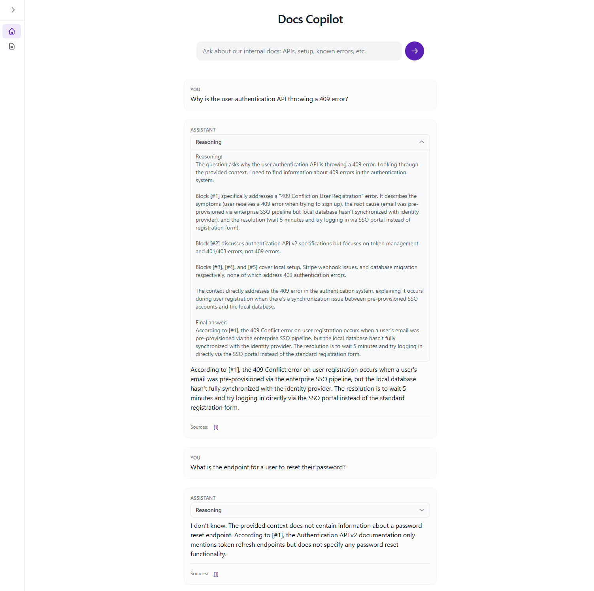

# Docs Copilot

A RAG (Retrieval-Augmented Generation) chatbot that lets you ask questions in natural language over your internal markdown documentation. Answers are grounded in ingested docs and include clickable citations with inline previews.

URL: [https://docs-copilot.vercel.app/](https://docs-copilot.vercel.app/)



## Features

- **Chat interface** — Ask questions in plain language; the assistant answers only from your ingested docs and says "I don't know" when the context doesn't contain the answer.
- **Citations** — Each answer references source chunks with clickable citations; hover or click to see an inline preview of the cited text.
- **Document ingestion** — Ingest markdown via the **Documents** page (upload to S3 + embed into Pinecone) or via CLI for local `docs/` files.
- **Collapsible sidebar** — Navigate between **Home** (chat) and **Documents** (ingest & list of ingested files with view links).

## Tech stack

| Layer | Technology |
|-------|------------|
| **App** | Next.js 14 (App Router), TypeScript, Tailwind CSS |
| **Chat (LLM)** | [OpenRouter](https://openrouter.ai/) — free models (e.g. `openai/gpt-oss-120b:free`, `meta-llama/llama-3.2-3b-instruct:free`, `google/gemma-2-9b-it:free`) |
| **Embeddings** | [Hugging Face](https://huggingface.co/) Inference API (`hf-inference`) — e.g. `sentence-transformers/all-MiniLM-L6-v2` (384 dimensions) |
| **Vector store** | [Pinecone](https://www.pinecone.io/) — 384 dimensions, cosine similarity |
| **File storage** | [AWS S3](https://aws.amazon.com/s3/) — uploaded markdown files |
| **Chunking** | [LangChain](https://langchain.com/) — `MarkdownTextSplitter` (chunk size 1200, overlap 200) with per-chunk heading path metadata (e.g. "Known Errors > 409 Conflict") for section-aware retrieval and citations |
| **Hosting** | [Vercel](https://vercel.com/) — serverless deployment |

## Ingesting documents

**From the UI (Documents page)**

1. Go to **Documents** in the sidebar.
2. Click **Ingest / Input New Documents** and choose one or more `.md` files.
3. Files are uploaded to S3 and chunked, embedded, and upserted into Pinecone. The list below updates with links to **View** (presigned S3 URL) each document.

## Chunking strategy

Documents are split with LangChain’s **MarkdownTextSplitter** so boundaries respect markdown structure (headers, lists, code blocks). Each chunk has:

- **Size:** 1200 characters, 200 character overlap between consecutive chunks.
- **Heading path:** The nearest heading(s) above the chunk are stored as metadata (e.g. `Known Errors > 409 Conflict`). This is used to label context in the chat and to show section-aware citations.
- **Line range:** Start and end line numbers in the source file for precise citation and “View” links.

## Running Locally

```bash
npm run dev
```

Open [http://localhost:3000](http://localhost:3000). Use **Home** to chat and **Documents** to ingest and list files.

## Environment variables

Copy `.env.example` to `.env.local` and fill in your keys. Required for local dev and for Vercel.

| Variable | Description |
|----------|--------------|
| `HUGGINGFACE_API_KEY` | Hugging Face token (embeddings; used by ingest + retrieval) |
| `HUGGINGFACE_EMBEDDING_MODEL` | Optional. Default: `sentence-transformers/all-MiniLM-L6-v2` (384 dims) |
| `OPENROUTER_API_KEY` | OpenRouter API key (chat LLM) |
| `OPENROUTER_CHAT_MODEL` | Optional. Default: `meta-llama/llama-3.2-3b-instruct:free` |
| `PINECONE_API_KEY` | Pinecone API key |
| `PINECONE_INDEX_NAME` | Pinecone index name (create index with dimension **384**) |
| `PINECONE_CLOUD` | e.g. `aws` |
| `PINECONE_REGION` | e.g. `us-east-1` |
| `AWS_REGION` | AWS region for S3 (e.g. `us-east-1`) |
| `AWS_ACCESS_KEY_ID` | IAM access key with S3 access |
| `AWS_SECRET_ACCESS_KEY` | IAM secret key |
| `DOCS_S3_BUCKET` | S3 bucket name for uploaded markdown files |
| `INGEST_PASSWORD` | If set, upload/ingest on the Documents page requires this password |

## Project structure

```
src/
├── app/
│   ├── api/
│   │   ├── chat/        # POST: question → answer + citations
│   │   ├── documents/   # GET: list S3 docs with view URLs
│   │   └── ingest/      # POST: upload .md → S3 + Pinecone
│   │       └── verify/  # POST: verify ingest password (200/401)
│   ├── documents/      # Documents page (ingest button + doc list)
│   ├── layout.tsx      # Root layout with sidebar
│   └── page.tsx        # Home (chat UI)
├── components/
│   ├── Citation.tsx    # Clickable citation with hover preview
│   └── Sidebar.tsx     # Collapsible nav (Home, Documents)
└── lib/
    ├── embeddings/     # Hugging Face embeddings (e.g. all-MiniLM-L6-v2)
    ├── ingest/         # Markdown loading + chunking
    ├── pinecone/       # Index client + auto-create
    ├── storage/        # S3 client + upload helper
    └── vectorstore/    # Pinecone upsert + query
scripts/
└── ingest.ts           # CLI ingest for docs/
docs/                   # Optional: sample local .md files for CLI ingest
```
